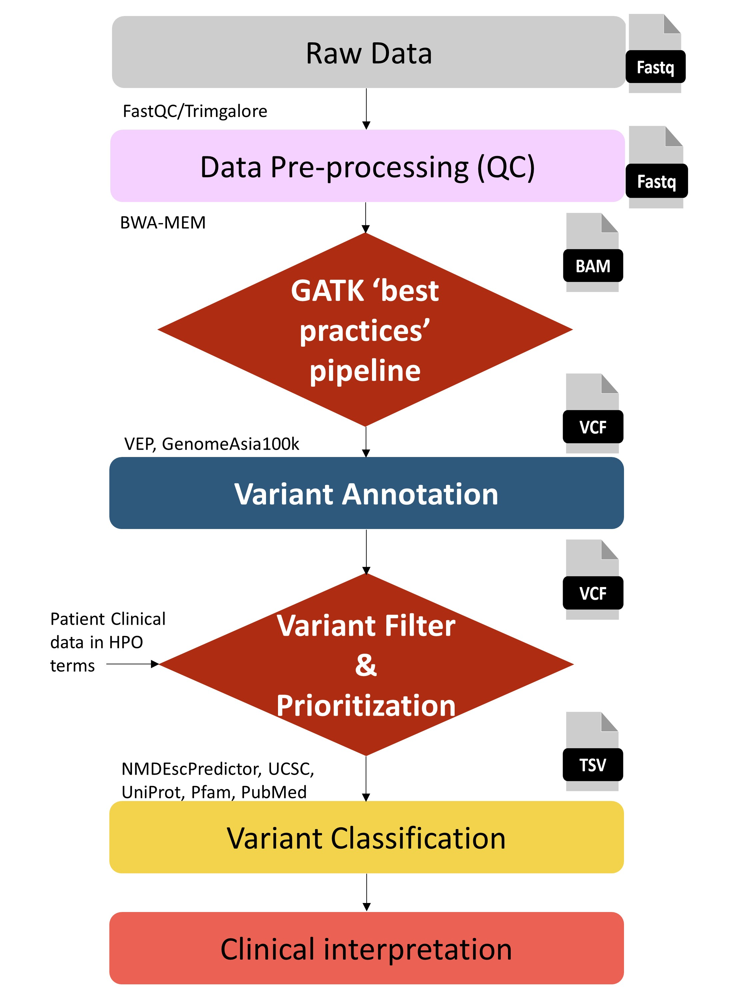
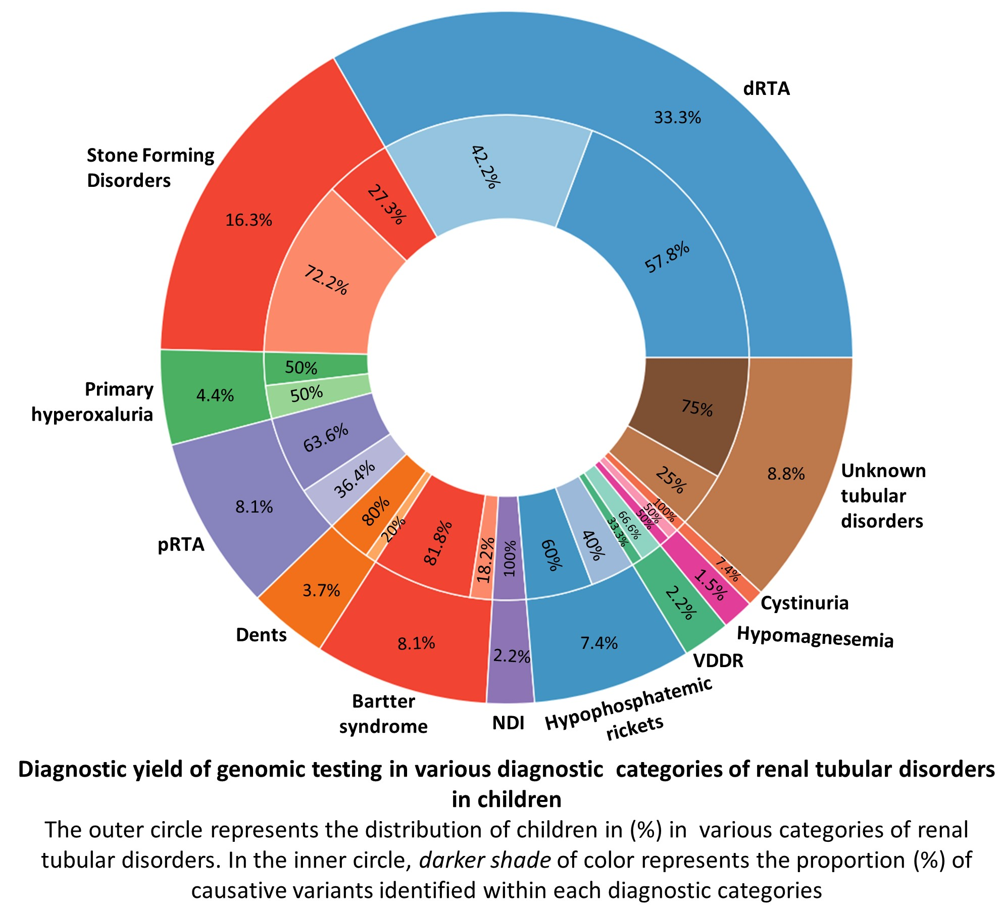
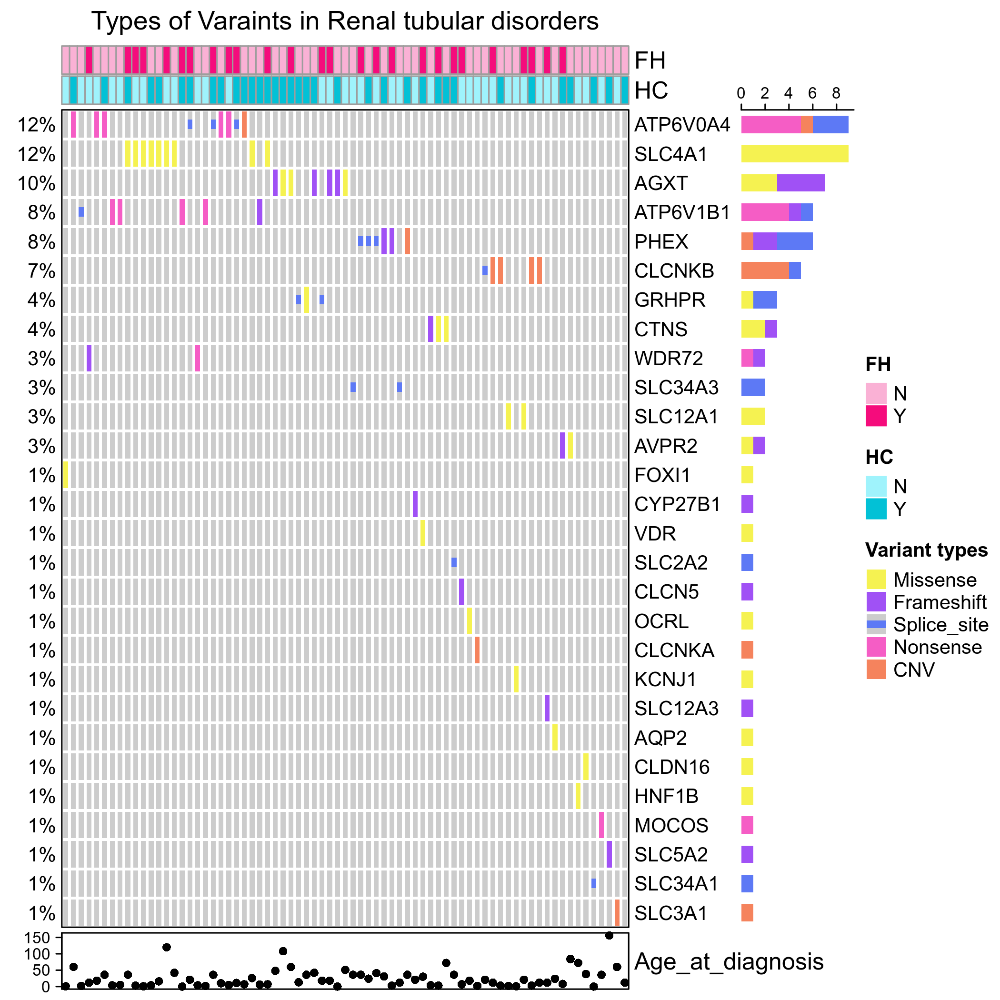
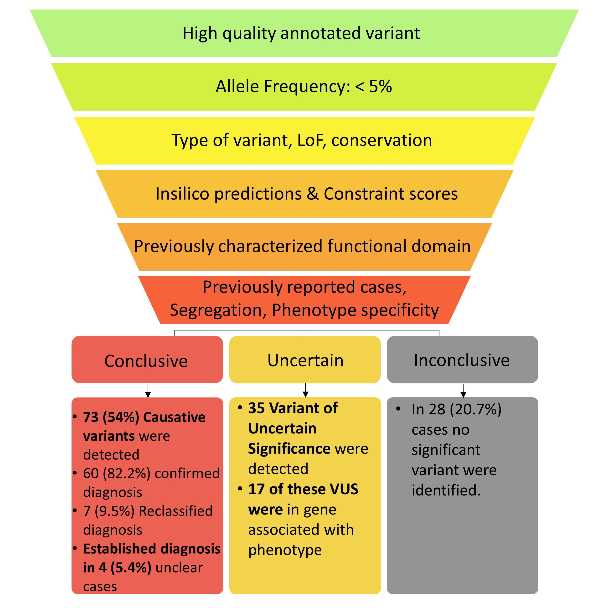
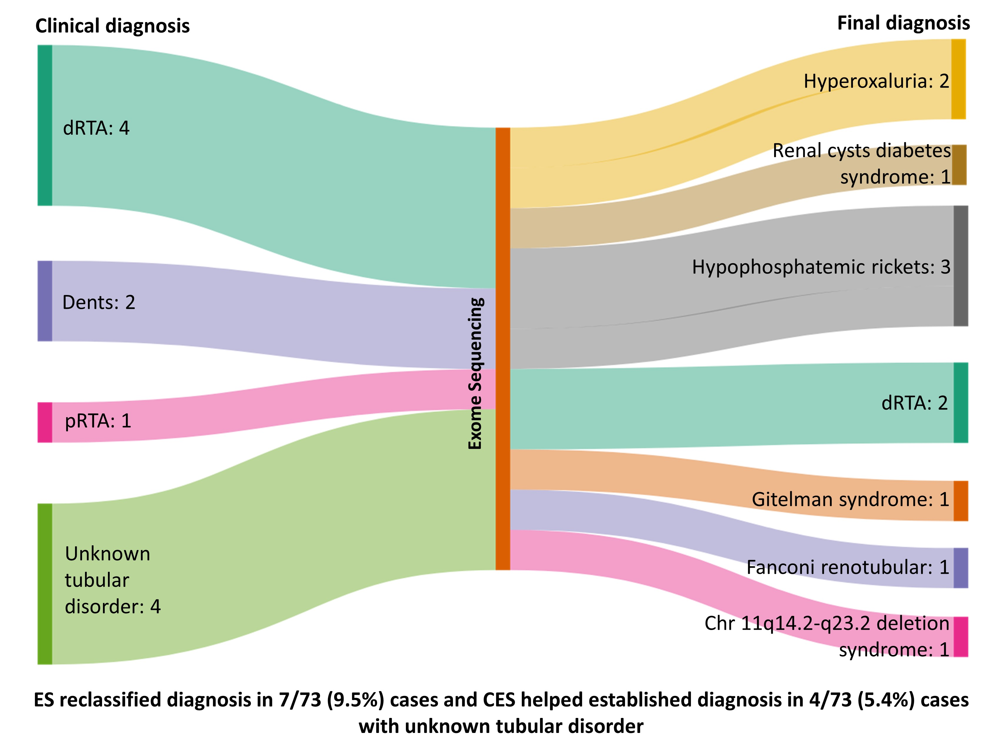

# UTILITY OF EXOME SEQUENCING IN INDIAN CHILDREN WITH RENAL TUBULAR DISORDERS

### Hypothesis/Research question
- To determine the diagnostic yield of Exome Sequencing (ES) and its utility in confirming diagnosis in clinical setting  

### Findings

- ES used in diagnostic workflow helps to confirm molecular diagnosis (54%).     

- ES revising clinical diagnosis or establish etiology in previously undiagnosed tubular diseases (8 %).     

### Samples
Total Number of Patients Screened: **225**    
Total Number of Patients Samples sequenced: **135**    
 
### Data
    
- Patients and Clinical data:  
Children with clinically diagnosis or suspected to have renal tubulopathy (children < 18 years of age). Clinical data, laboratory and pedigree information.     

### Study methodology

- Kit: Agilent SureSelect    
- Platform: Illumina Hiseq (150 bps, PE, mean coverage 80 – 100X)    

### Results

- Diagnostic yield of genomic testing in various diagnostic  categories of renal tubular disorders in children    

   
- Summary of distribution of causative variants on the basis of individual genes associated with renal tubular disorders     

Each row represents a gene and each column a patient along with the type of variant (colored squares), family history (FH) & consanguinity (HC) and age at diagnosis (lower graph)     
- Variants detected by ES following in-house tertiary analysis pipeline    

- Sankey plot depicting reclassification of diagnosis by ES    

ES reclassified diagnosis in 7/73 (9.5%) cases and ES helped established diagnosis in 4/73 (5.4%) cases with unknown tubular disorder     

### Links of Resources/Databases/Tools used

| Name | Link |
| --- | --- |
| OMIM | http://omim.org/ |
| PubMed | http://www.ncbi.nlm.nih.gov/pubmed/ |
| gnomAD | https://gnomad.broadinstitute.org/ |
| Genome Asia 100k | https://browser.genomeasia100k.org/ |
| IndiGenomes | https://clingen.igib.res.in/indigen/ |
| Human Phenotype Ontology | https://hpo.jax.org/app/ |
| UCSC Genome Browser | https://genome.ucsc.edu/ |
| Ensembl Variant Effect Predictor | https://www.ensembl.org/vep |
| ClinVar | https://www.ncbi.nlm.nih.gov/clinvar/ |
| UniProt | https://www.uniprot.org/ |
| NCBI Genetic Testing Registry | https://www.ncbi.nlm.nih.gov/gtr/ |
| Genomics England PanelApp | https://panelapp.genomicsengland.co.uk/ |
